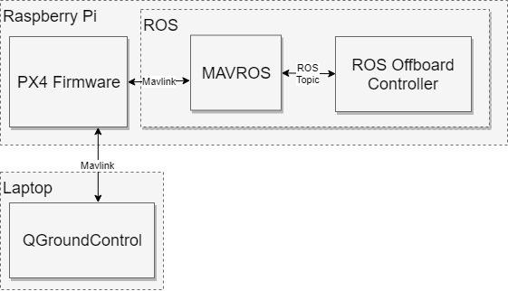

# ROS_Multidrone Controller
This is a ROS package for use in developing multi-quadcopter applications. It is capable of generating multiple PX4 flight controller instances, which can be simulated using SITL in Gazebo (master or michael-vel branches) or run on hardware (hardware branch). Below are instructions for setting this up as well as running the modules.

Tested for:
- Ubuntu 18.04
- ROS Melodic
- Gazebo 9
- PX4 1.10
_________________________________________________________________

## First time setup:
1. Install ROS Melodic under Ubuntu 18.04 http://wiki.ros.org/melodic/Installation/Ubuntu
2. Run ubuntu_sim_ros_melodic.sh from https://dev.px4.io/v1.10/en/setup/dev_env_linux_ubuntu.html#rosgazebo
     - This installs additional tools (mavros, px4 sitl) necessary for integration with px4 and running/visualizing drones.
     ```
     wget https://raw.githubusercontent.com/PX4/Devguide/v1.10/build_scripts/ubuntu_sim_ros_melodic.sh
     chmod +x ubuntu_sim_ros_melodic.sh
     source ubuntu_sim_ros_melodic.sh
     ```
     (Last updated 03-28-20)
2. Install PX4 firmware
    - Clone the PX4 firmware repository: https://github.com/PX4/Firmware
    - Path to this repo is referenced in gen_models.py and launch_sim.sh, and should be changed as appropriate.
    ```
    git clone https://github.com/PX4/Firmware.git --recursive
    cd Firmware
    git submodule update --init --recursive
    bash ./Tools/setup/ubuntu.sh
    make px4_sitl_default gazebo
    ```
3. Clone this repo to your machine
     ```
     git clone https://github.com/UCSD-SEELab/ROS_Multidrone.git
     ```
## Running simulation:
1. Ensure paths in launch_sim.sh and gen_models.py are set up properly.
  - ROS_SIM_DIR should point to where ROS_Multidrone was cloned: ie. ~/ROS_Multidrone
  - FIRMWARE_DIR should point to where PX4's firmware was cloned: ie. ~/Firmware

2. Change osrf server under ~/.ignition/fuel/config.yaml
```
url: https://fuel.ignitionrobotics.org
```

3. Run launch_sim with num_drones as param to build project, generate models, and start ROS/Gazebo/PX4. 
```
cd ROS_Multidrone/scripts
chmod +x launch_sim.sh
./launch_sim.sh <num_drones>
```
- When exiting, ctrl+c the gazebo terminal on top right and wait for it to clean up before closing terminal
- The Python and C++ controllers can be closed at any time without leaving artifacts behind.

## Architecture
On NAVIO2 + Raspberry Pi hardware, the connections would be set up according to the following:


In software, connections are as follows:



## More about simulation scripts:
can be found under scripts/README.md

- Port number indicates starting port in the range [starting_port, starting_port + 4 * number_of_drones] which must be a free block of ports that can be allocated to mavros->ROS/Gazebo interactions. Something like 9000 or 10000 usually works well here.
- Note for future: After investigating more recent changes to PX4 Firmware, it looks like it is buggy on the port assignments. They are moving towards a single, unified vehicle startup model, which would require modifications to Firmware/ROMFS/px4fmu_common/init.d-posix/rcS to properly assign ports.
______________________________________________________________________________
# ROS MSG Parameters [Based on PX4 ver]

When running simulation, it is possible to tap into ROS topics to see what is happening in the system:
```
rostopic list
rostopic echo <topic_name>
(ctrl+c to exit)
```

ROS Topics
1. mavros/state - tells current flight mode of the drone [https://dev.px4.io/en/concept/flight_modes.html]
2. droneObj - custom topic that tells drone the next objective in LLA format
3. mavros/global_position/global - GPS information
4. mavros/setpoint_position/global - tells drone where to go in LLA
     - *PX4 does not have LLA setpoint function. this topic will take in LLA format and 
    translate it into x,y,z format and send to FCU. However I encountered a problem
    with the time stamp safty feature, I managed to get it working after removing
    such safty feature in the source code then rebuild mavros.*
     - *In "\~/catkin_ws/src/mavros/mavros/src/plugins/setpoint_position.cpp" at line 225
    remove the if-else statement and just let it call "send_position_target(req->header.stamp, sp);"
    rebuild mavros by running "catkin build" in "\~/catkin_ws"*

Services
1. mavros/cmd/arming - arm the drone
2. mavros/set_mode - set the current flight mode
______________________________________________________________________________
